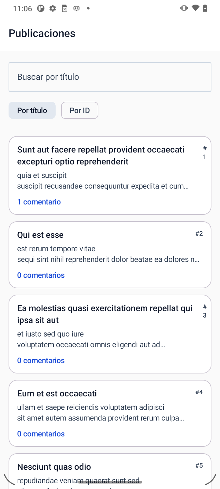
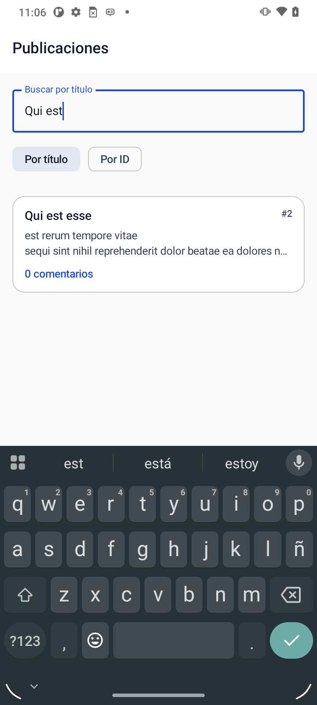
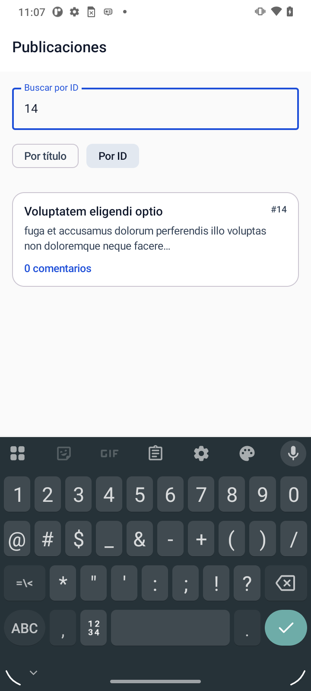
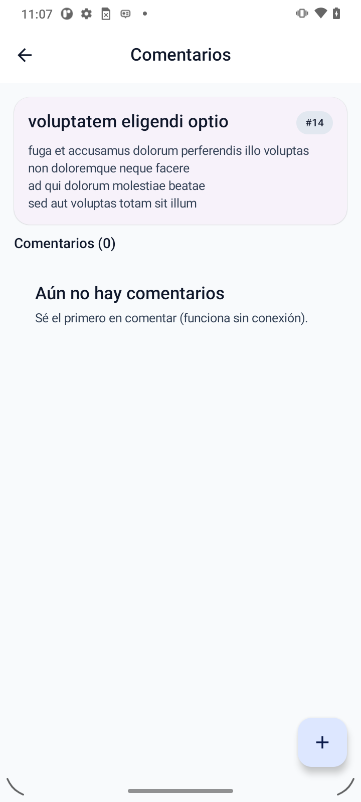
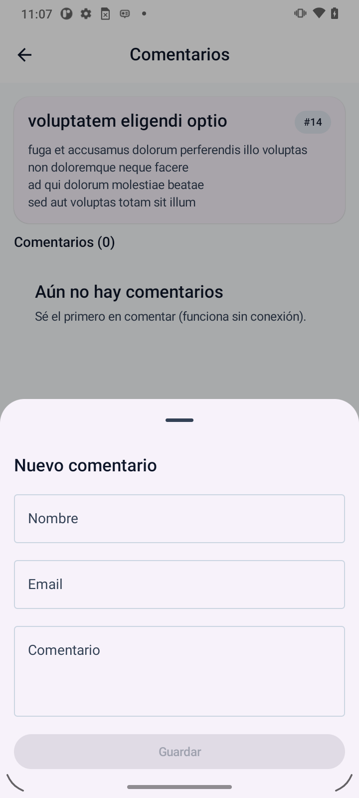
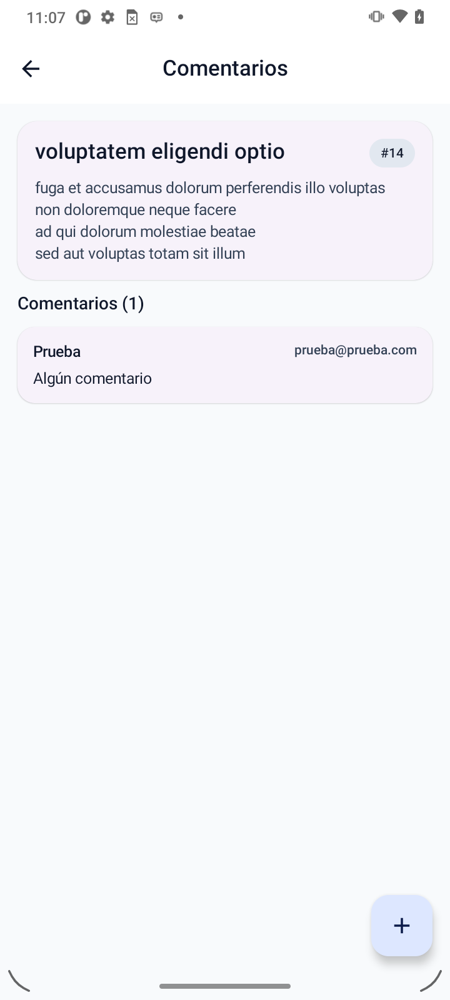

# KMP Post

Aplicación Kotlin Multiplatform que consume la API de [JSONPlaceholder](https://jsonplaceholder.typicode.com), persiste los datos localmente con Room y los presenta en Android, iOS y Desktop desde una sola base de código compartida.

---

## ¿Qué hace la app?

- Lista publicaciones con búsqueda en tiempo real por título o ID
- Muestra el detalle de cada post junto con sus comentarios
- Permite agregar comentarios localmente
- Funciona sin conexión: si ya sincronizó una vez, los datos quedan guardados

El flujo es offline-first: al abrir la app se muestra lo que haya en la base de datos local mientras la sincronización con la API ocurre en segundo plano. Sin pantallas de "cargando" innecesarias.

---

## Stack técnico

| Área | Tecnología |
|---|---|
| UI | Compose Multiplatform + Material 3 |
| Red | Ktor Client (CIO en Android/Desktop, Darwin en iOS) |
| Base de datos | Room KMP + SQLite Bundled |
| DI | Koin 4 |
| Estado | StateFlow + ViewModel (lifecycle-viewmodel KMP) |
| Tests | kotlin.test + kotlinx-coroutines-test |
| Build | Gradle KTS + KSP + Version Catalog |

---

## Plataformas

| Plataforma | Entry point | Motor HTTP | DB path |
|---|---|---|---|
| Android | `MainActivity` + `KmpApplication` | CIO | `getDatabasePath("post.db")` |
| iOS | `MainViewController` | Darwin | `NSHomeDirectory/Documents/post.db` |
| Desktop (JVM) | `main()` | CIO | `~/.kmppost/post.db` |

---

## Arquitectura

El proyecto sigue una arquitectura de capas con separación estricta. Todo el código de negocio vive en `commonMain`; las plataformas solo aportan el motor de red, la ruta de la base de datos y el punto de entrada.

```
composeApp/src/
├── commonMain/
│   ├── data/
│   │   ├── remote/          # DTO + Ktor (PostApiService)
│   │   ├── repository/      # Implementaciones de repositorios
│   │   └── mapper/          # Funciones de mapeo entre capas
│   ├── database/
│   │   ├── entity/          # PostEntity, CommentEntity, PostWithCommentCount (View)
│   │   └── dao/             # PostDao, CommentDao, PostWithCommentCountDao
│   ├── domain/
│   │   └── usecase/         # ObservePosts, SyncPosts, ObserveComments, AddComment
│   ├── models/              # Modelos de dominio (PostModel, CommentModel)
│   ├── ui/
│   │   ├── uiModels/        # Estados de UI (sealed interfaces) y modelos de presentación
│   │   ├── PostsViewModel
│   │   └── PostDetailViewModel
│   └── di/                  # Módulos Koin (database, data, domain, viewModel)
├── androidMain/             # KmpApplication, PlatformModule.android
├── iosMain/                 # MainViewController, PlatformModule.ios
└── jvmMain/                 # main(), PlatformModule.jvm
```

### Capas y flujo de datos

```
  API (Ktor)
      │  PostDto
      ▼
  PostRepositoryImpl  ──upsert──▶  Room (PostEntity / CommentEntity)
      │                                │
      │                    ┌───────────┘
      │                    │  PostWithCommentCount (DatabaseView)
      ▼                    ▼
  UseCase  ◀──── Flow<List<PostModel>>
      │
      ▼
  ViewModel  ──combine(posts + query + mode + syncError)──▶  PostsUiState
      │
      ▼
  Compose UI
```

La separación no es solo decorativa. Los use cases permiten testear la lógica de negocio sin tocar Room, Ktor ni Compose. Los repositorios no saben qué pantalla los consume. Los ViewModels no saben si los datos vienen de caché o de red.

### Vista SQL en Room

En lugar de hacer dos queries separadas y unirlas en Kotlin, la capa de base de datos expone una `@DatabaseView` que el motor SQLite resuelve eficientemente:

```sql
SELECT p.id, p.title, p.body, p.user_id, p.last_sync_at,
       COUNT(c.id) AS comment_count
FROM posts p
LEFT JOIN comments c ON p.id = c.post_id
GROUP BY p.id
```

`PostWithCommentCountDao.observeAll()` devuelve un `Flow` que Room invalida automáticamente cada vez que cambia alguna de las dos tablas subyacentes.

### Inyección de dependencias

Koin está dividido en cuatro módulos para que sea fácil agregar o reemplazar piezas:

```kotlin
val databaseModule  // DAOs
val dataModule      // ApiService + Repositories
val domainModule    // UseCases (factory, no singleton)
val viewModelModule // ViewModels
// + platformModule por plataforma (DB builder + HttpClient)
```

Los use cases son `factory` (no `single`) porque son stateless: no tiene sentido mantenerlos vivos entre pantallas.

---

## Cómo ejecutar

**Android**
```bash
# macOS / Linux
./gradlew :composeApp:installDebug

# Windows
.\gradlew.bat :composeApp:installDebug
```

**Desktop**
```bash
./gradlew :composeApp:run
```

**iOS**  
Abrir `iosApp/` en Xcode y ejecutar desde ahí.

---

## Tests

```bash
# Todos los targets
./gradlew :composeApp:allTests

# Solo JVM (más rápido en desarrollo)
./gradlew :composeApp:jvmTest
```

Los tests están en `commonTest` y no dependen de ninguna plataforma concreta. Se usan implementaciones falsas (`FakePostRepository`, `FakeCommentRepository`) en lugar de mocks para mantener los tests legibles y sin librerías adicionales.

```
commonTest/
├── fakes/
│   ├── FakePostRepository
│   └── FakeCommentRepository
├── mapper/
│   └── PostMapperTest             (6 tests — mapeos entre capas)
└── usecase/
    ├── ObservePostsUseCaseTest    (2 tests)
    ├── SyncPostsUseCaseTest       (2 tests)
    ├── ObserveCommentsUseCaseTest (2 tests)
    └── AddCommentUseCaseTest      (2 tests)
```

---

## Decisiones técnicas notables

**`BundledSQLiteDriver` en lugar del driver nativo de Android**  
Permite usar el mismo driver en las tres plataformas. El costo es un incremento pequeño en el tamaño del binario; la ventaja es que iOS y Desktop tienen SQLite funcional sin configuración adicional.

**`expect/actual` para el timestamp**  
`kotlinx-datetime` no incluye su artefacto JVM en el classpath de Compose Desktop de forma automática. En lugar de forzar la dependencia o agregar workarounds de Gradle, se expone `expect fun currentTimeMillis(): Long` y cada plataforma resuelve con `System.currentTimeMillis()` o `NSDate().timeIntervalSince1970`.

**`collectAsState()` en lugar de `collectAsStateWithLifecycle()`**  
`collectAsStateWithLifecycle` requiere `LocalLifecycleOwner`, que en Desktop JVM no está garantizado fuera de un contexto de Activity. `collectAsState()` funciona igual en las tres plataformas sin sacrificar nada relevante.

**Use cases como `factory`, no `single`**  
Son funciones que delegan en repositorios sin acumular estado propio. Instanciarlos como singleton solo añadiría retención de memoria sin ningún beneficio.

---

## Capturas de pantalla

### Android

| Lista de publicaciones | Búsqueda por título | Búsqueda por ID |
|---|---|---|
|  |  |  |

| Detalle de post | Agregar comentario | Comentario agregado |
|---|---|---|
|  |  |  |

| Lista actualizada |
|---|
|  |

### Desktop

| Lista de publicaciones | Detalle con comentario | Búsqueda por título |
|---|---|---|
|  |  |  |

### Database Inspector


